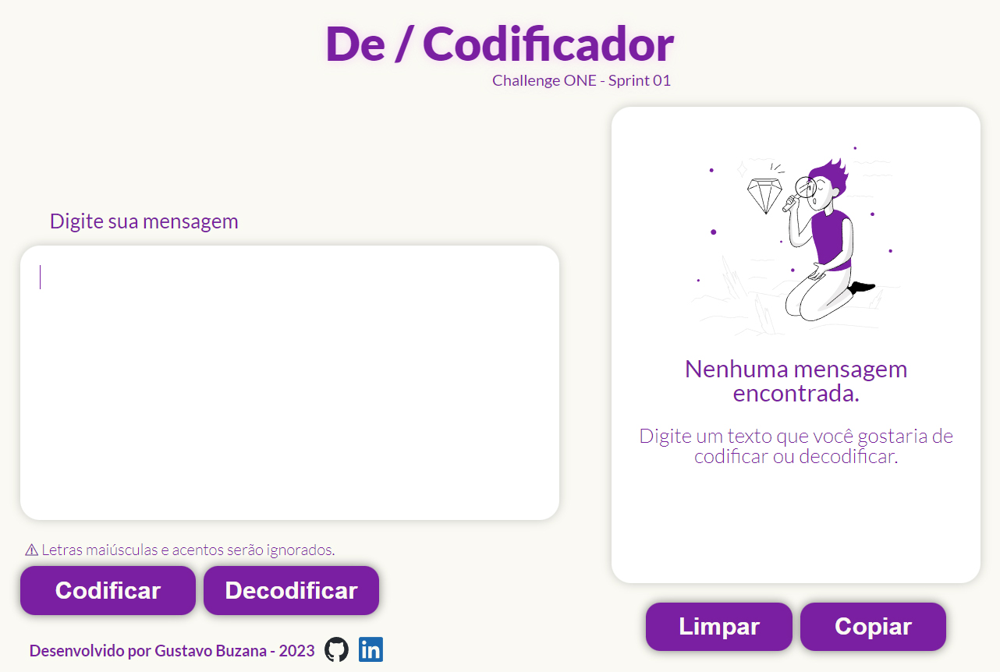

<h1 align="center">De/Codificador</h1>
<h2 align='center'>Alura ONE Challenge - Sprint 01</h2>

  <a href='#-desafio'>Desafio</a> |
  <a href='#-chaves'>Chaves</a> |
  <a href='#-tecnologias'>Tecnologias</a> |
  <a href='#-projeto'>Projeto</a>

  

## 🏆 Desafio
Esse projeto faz parte do programa Alura ONE, sendo o primeiro challenge proposto. O programa foi criado para criptografar e descriptografar textos, usando como chaves as vogais. Letras maiúsculas e/ou acentuadas e caracteres especiais serão ignorados.

Como extras, foram feitos botões para copiar o texto e limpar a tela.

## 🔑 Chaves
Os valores das chaves são os seguintes:

| a | e | i | o | u |
|--|--|----|----|--
| ai | enter | imes | ober | ufat

Para criptografar, cada vogal é substituída por uma respectiva chave, e para descriptografar, ocorre o inverso.

## 💻 Tecnologias
Esse projeto foi desenvolvido utilizando as seguintes tecnologias:
- HTML
- CSS
- Javascript

## 📜 Projeto
Para acessar o projeto, clique [aqui](https://gusbuz.github.io/De-Codificador-ONE/).